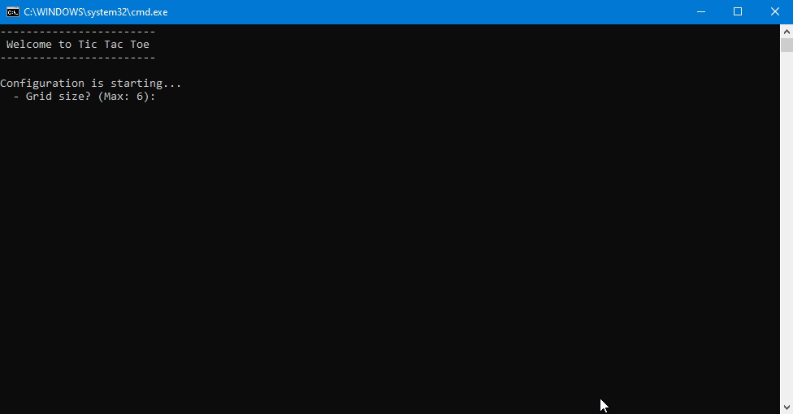

# Console Tic Tac Toe

Console version of the game with dynamic grid size, up to 6 Human or IA players

## Demo

## How to play
1. [Download source code](https://github.com/LukBlan/console-tic-tac-toe/archive/refs/heads/main.zip)
2. Extract downloaded folder
3. Go to scripts sub folder and double-click on download (it gonna start downloading without installing)
4. Extract the new rubyinstaller-3.2.2-1-x64.7z file in scripts sub folder
5. Double-click on run to start the game